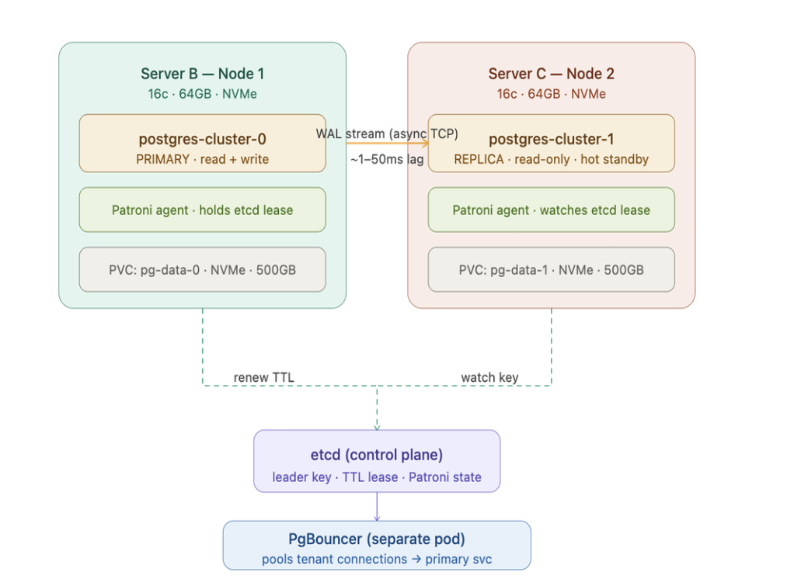
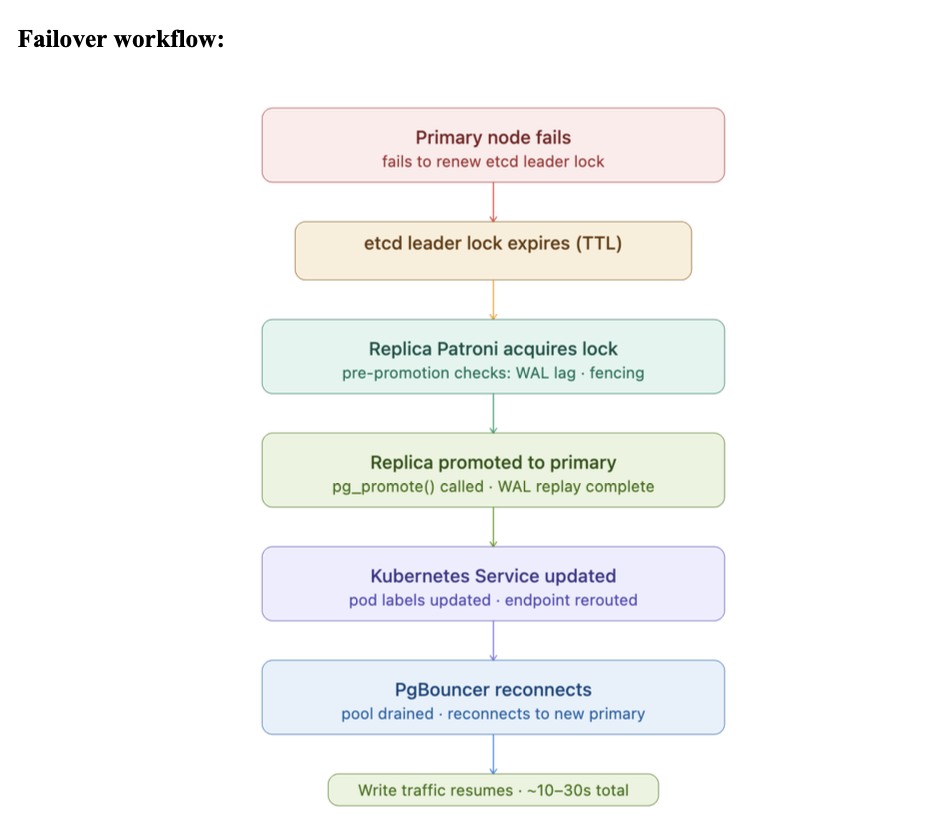
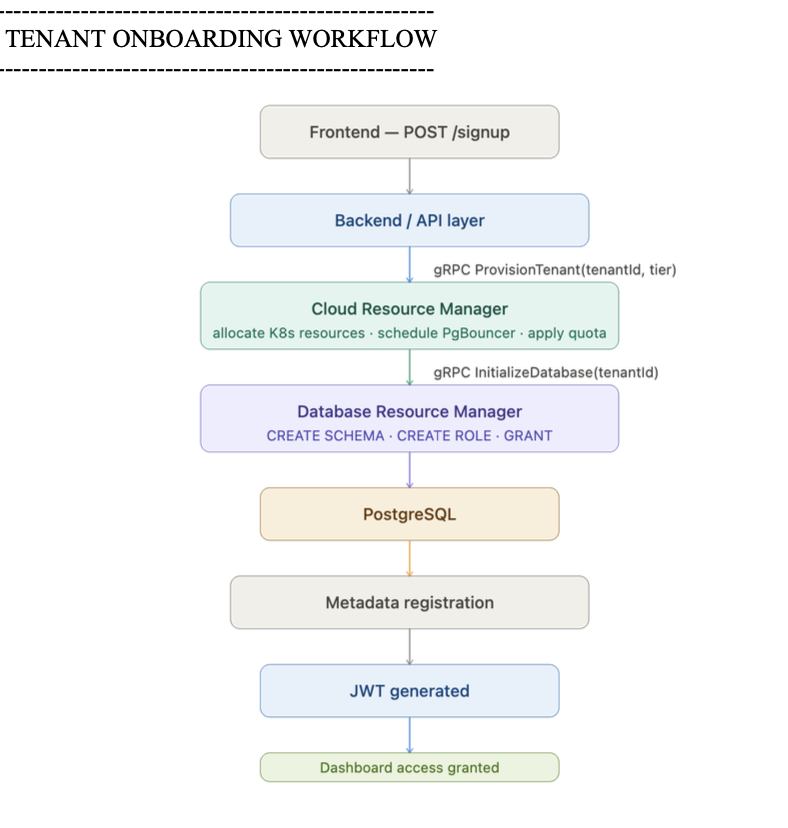

# IntelliDB — Orchestration & Resource Management Layer with Monitoring

The Kubernetes infrastructure and observability layer I independently built for **IntelliDB**, a collaborative multi-tenant DBaaS (Database-as-a-Service) prototype. This repo contains only my individual contribution — the `cloud/` and `prometheus/` layers — extracted from the full team project to keep attribution clean.

---

## What This Project Does

Provides the infrastructure backbone for a multi-tenant PostgreSQL DBaaS:
1. A self-healing, highly-available PostgreSQL cluster (Patroni + etcd) that auto-promotes a replica if the primary fails
2. A gRPC API that provisions/tears down tenants programmatically, coordinating schema creation on the shared cluster
3. PgBouncer connection pooling in front of the database, independent of database pod restarts
4. Least-privilege RBAC scoped separately per component, instead of one shared broad service account
5. A full Prometheus + Grafana stack for real-time cluster health and scaling visibility

---

## Architecture



```
Tenant App → PgBouncer → K8s Service (primary/replica) → PostgreSQL (Patroni) ⇄ etcd
                                                                  │
                                                          Prometheus → Grafana
```

**Flow:**
- **Write/Read Stage:** PgBouncer routes writes to the primary service, reads optionally to the replica service
- **HA Stage:** Patroni agents on each PostgreSQL pod hold/watch a leader lease in etcd; primary and replica are pinned to different nodes via anti-affinity
- **Failover Stage:** If the primary fails to renew its etcd lease, the replica promotes itself automatically — no manual intervention
- **Provisioning Stage:** The `cloud-grpc` service handles tenant lifecycle calls, coordinating with a Database Resource Manager to create/drop schemas
- **Observability Stage:** Custom Prometheus metrics from `cloud-grpc` + cluster metrics feed 3 Grafana dashboards

### Failover in detail


### Tenant onboarding in detail


---

## Components Used

| Component | Purpose |
|---|---|
| PostgreSQL (Spilo image) | Database engine |
| Patroni | Automated failover and leader election agent |
| etcd | Distributed key-value store backing Patroni's leader lease |
| PgBouncer | Connection pooling, deployed as a separate stateless pod |
| gRPC (`cloud-grpc`) | Tenant provisioning API |
| Kubernetes RBAC | Least-privilege access scoping per component |
| Prometheus | Metrics collection |
| Grafana | Dashboards for cluster health and scaling telemetry |

---

## Repository Structure

```
cloud/
├── grpc/          → Provisioning API (server, provisioner, metrics, proto defs)
├── k8s/            → StatefulSet, PgBouncer, RBAC, etcd, services, secrets
└── scripts/        → deploy.sh, teardown.sh, validate.sh, test-failover.sh

prometheus/
├── prometheus.yml                          → Scrape config
└── grafana/provisioning/
    ├── dashboards/                          → 3 pre-built dashboards
    └── datasources/                         → Prometheus datasource wiring

images/             → Architecture and workflow diagrams
```

---

## Key Files Explained

### `cloud/k8s/statefulset.yaml`
Runs PostgreSQL via the Spilo image (bundles Patroni). Pod anti-affinity ensures primary and replica never land on the same node. PVCs give each pod stable, independent storage that survives restarts.

### `cloud/k8s/rbac.yaml`
Two separate Roles instead of one shared service account: Patroni gets ConfigMap/pod/endpoint patch access (needed for leader election bookkeeping); the gRPC service gets read-only pod/PVC access plus StatefulSet patch access (needed only for scaling operations).

### `cloud/grpc/server.py` + `provisioner.py`
The gRPC server exposing `ProvisionTenant`, `TerminateTenant`, and `GetInfraStatus`, backed by a provisioner that talks to a separate Database Resource Manager service for actual schema creation.

### `cloud/grpc/metrics.py`
9 custom Prometheus metrics — provisioning latency, cluster CPU/RAM/storage, Patroni replication lag, and scaling events — exposed for Prometheus to scrape.

---

## Key Decisions and Why

**Spilo/Patroni over vanilla PostgreSQL:** Vanilla Postgres has no built-in failover — a primary crash means manual intervention. Patroni automates leader election via etcd, so failover happens in ~10-30 seconds without anyone paging in.

**PgBouncer as a separate pod, not a sidecar:** Keeping the pooler independent of the database pods means connection pooling survives database restarts/failovers instead of resetting every time PostgreSQL does.

**Separate RBAC roles instead of one shared service account:** A single broad service account is a bigger blast radius if any one component is compromised. Splitting Patroni's and the gRPC service's permissions means neither can do more than it strictly needs to.

**Independently added Prometheus + Grafana:** This wasn't part of the original team scope — added it because a DBaaS with no visibility into cluster health isn't actually production-viable, and "how do we know it's healthy" felt like a gap worth closing myself.

---

## What a Production Version Would Add

- Synchronous replication option for zero-RPO tenants willing to trade write latency (see `async-vs-sync-postgresql-replication.png` for the tradeoff comparison already scoped out)
- Automated DR orchestration — current DR plan is a documented manual recovery sequence (pilot-light model), not yet scripted
- Secrets pulled from a real secrets manager instead of the placeholder `secrets.yaml` committed here
- Terraform for the underlying node infrastructure instead of manually provisioned nodes
- Alerting rules (Alertmanager) on top of the existing Prometheus metrics, not just dashboards

---

## Notes

- `secrets.yaml` is included with **placeholder values only** — no real credentials are committed to this repo.
- This repo reflects only my individual contribution to the larger IntelliDB team project — frontend, backend API, and db-manager components built by teammates are intentionally excluded here.
